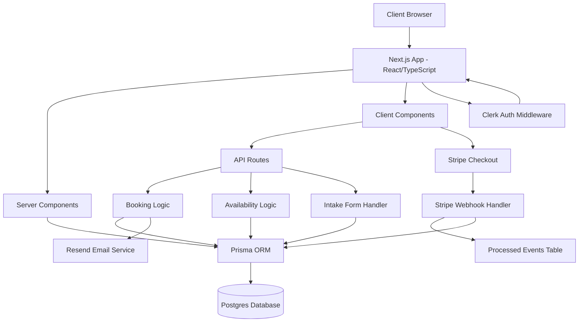

# Calyx

A booking SaaS for **freelance developers and consultants** to sell paid consultation and discovery calls — with a custom intake form so clients share project details upfront, before the call ever happens.

**Live demo:** [calyx-gold.vercel.app](https://calyx-gold.vercel.app) &nbsp;•&nbsp; **Demo video/GIF:** coming soon

---

## Why I built this

Freelance developers and consultants who charge for their time have no clean way to both take payment and gather context before a call. Generic schedulers like Calendly handle the calendar part fine, but leave you starting every paid call cold — no idea what the client actually needs, and no guarantee they'll show up having paid. Calyx bundles the booking, the payment, and a custom intake form into one flow, so by the time the call starts you already know what the client wants to talk about.

## Features

- 🔐 **Auth** — consultant accounts via Clerk; clients book as guests (no signup friction)
- 📅 **Availability & booking** — consultants set availability windows; clients book open slots with automatic double-booking prevention
- 💳 **Payments** — Stripe Checkout for pay-per-booking, with webhook-driven payment status
- 📋 **Custom intake form** — clients fill out project details (scope, budget range, timeline) at booking time, so the consultant walks in prepared
- 📧 **Email confirmations** — automated booking confirmations via Resend
- ⚡ **Real UX states** — loading skeletons, empty states, and error handling throughout (not just the happy path)

## Tech stack

| Layer | Choice |
|---|---|
| Language | TypeScript (full stack) |
| Frontend | React, Next.js (App Router) |
| Styling | Tailwind CSS |
| Database | PostgreSQL + Prisma ORM |
| Auth | Clerk |
| Payments | Stripe (Checkout + Webhooks) |
| Email | Resend |
| Hosting | Vercel |

## Known issues & technical debt

**Next.js pinned to v14.** Next 15/16 currently pull in Tailwind v4, whose native Windows binary (`@tailwindcss/oxide-win32-x64-msvc`) fails to install reliably in this environment — a known npm optional-dependency bug. Pinning to Next 14 with Tailwind v3 was the pragmatic call to keep the build moving.

**Consequence:** `npm audit` reports vulnerabilities in the Next 14 dependency tree, including a critical RCE advisory that applies to self-hosted Windows servers. Calyx deploys to Vercel (Linux), so the exposure is limited, but this is real technical debt.

**Plan:** upgrade to Next 16 + Tailwind v4 before final release, once the toolchain issue is resolved. Tracked rather than ignored.

## Architecture

